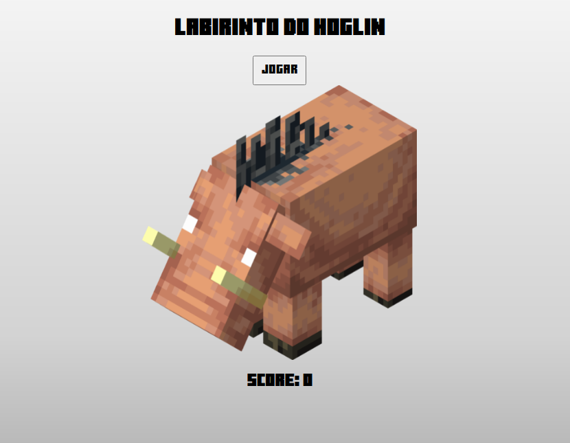
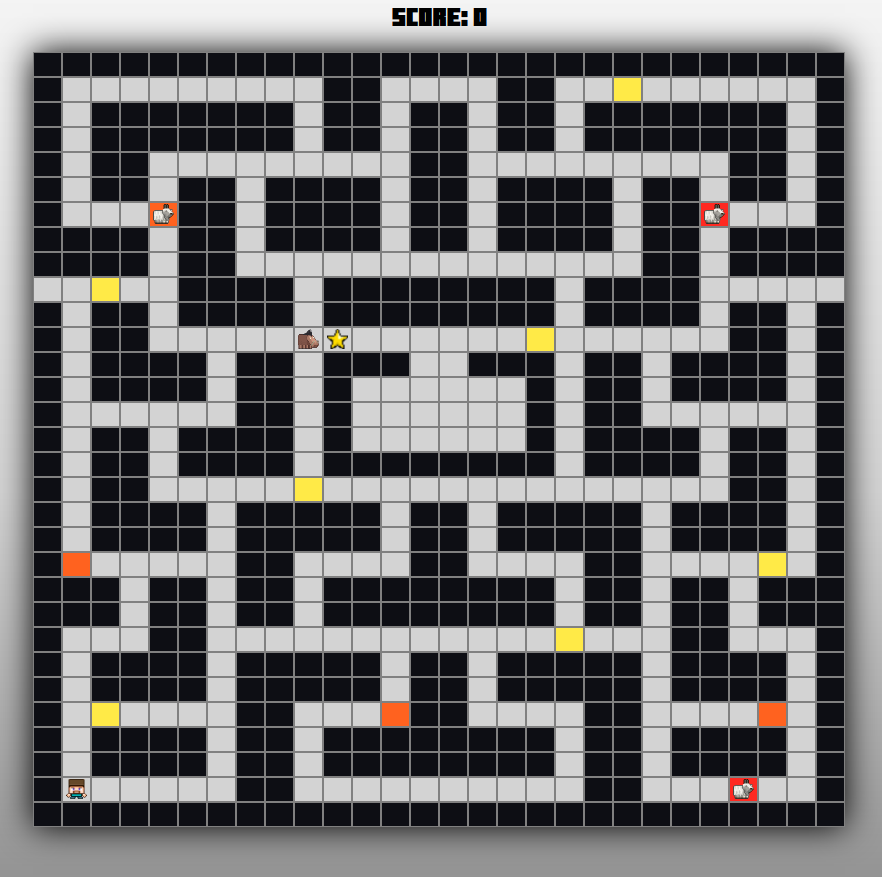
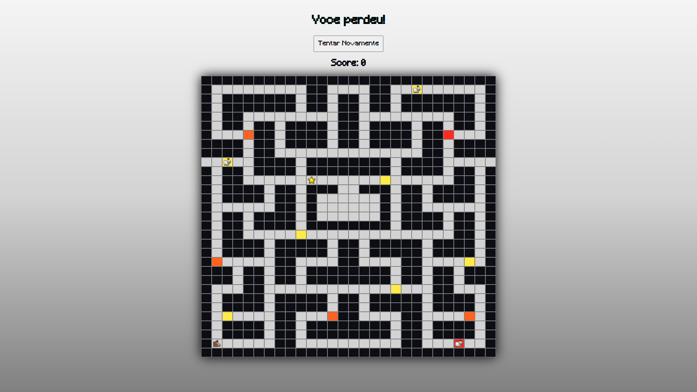

# Labirinto do Hoglin

**Número da Lista**: 2 
**Conteúdo da Disciplina**: Grafos2 

## Alunos
|Matrícula | Aluno |
| -- | -- |
| 19/0025379 |  Brenno Oliveira Silva |
| 19/0020377 |  Thiago Sampaio de Paiva |

## Sobre 
O labirinto do Hoglin utliza o algoritmo de Dijkstra para que o Hoglin encontre o jogador no menor caminho possível, enquanto as cabras utilizam um algoritmo que escolhe caminhos aleatórios.

## Screenshots

## Instalação 
**Linguagem**: Javascript 
**Pré-requisitos**: Navegador Web 

## Uso 
Para utilizar o projeto acesse:
ou abra o arquivo ´index.html´ no navega web de sua preferência